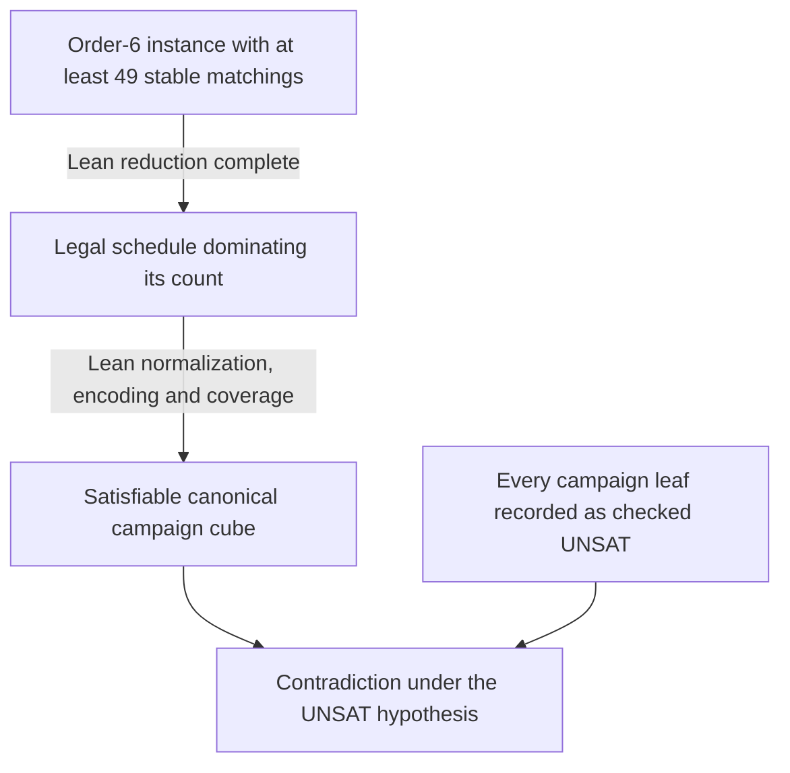

# How the proof and computation fit together

An instance gives strict preference lists for n men and n women. A perfect
matching is stable when no unmatched pair prefers one another to their
assigned partners. The project asks for the largest possible number of
stable matchings over all such instances.

## Order 5: direct reduction to UNSAT

1. Define instances, well-formedness, stability, and the matching count in Lean.
2. Relabel women so man 0's ranking is the identity.
3. Split on man 1's rank row: one of 120 permutations.
4. Prove that any instance in a cube with at least 17 stable matchings
   gives a satisfying assignment to the corresponding Lean-defined CNF.
5. Export those formulas, refute them, and check the certificates externally.
6. Combine the resulting upper bound with a kernel-checked witness of 16.

The [order-5 module map](../lean/README.md) follows this chain. The final
`f5_eq_16_of_unsat` theorem retains an explicit UNSAT hypothesis; the
certificate checker discharges that part outside Lean.

## Order 6: reduce instances to schedules

A **schedule** starts with the identity matching and applies cyclic partner
exchanges. Its trajectories record each participant's successive partners.
A **read-off instance** ranks those partners in trajectory order for men and
reverse trajectory order for women, then appends unvisited partners.

The formal reduction shows that every well-formed instance has a legal
schedule whose read-off instance has at least as many stable matchings.
Legality rules prevent partner revisits and imply the move budgets. At
order 6, at most 15 steps are needed.

The schedule CNF describes a sequence of matching states and step choices,
visited-partner masks, the resulting preferences, and 49 selected stable
matchings. A **cube** fixes an initial schedule prefix; a stopped cube also
requires the schedule to end there. Canonical root cubes plus adaptive
splits partition the cases used by the campaign.

The complete theorem `f6_eq_48_of_unsat` combines this upper bound with
the kernel-checked witness of 48. Its UNSAT hypothesis is checked externally;
the [evidence ledger](results.md) describes that boundary. In particular,
canonical bottom completion is not equivariant under arbitrary relabeling;
the [proof plan](design/f6-faithfulness.md) uses the order-preserving bridge
at the relabeled instance rather than assuming read-off commutes with relabeling.

## Two encodings with different roles

| Encoding | Source | Role |
|---|---|---|
| Direct Python instance encoding | [direct_encoding.py](../tools/direct_encoding.py) | Earlier SAT runs and profile enumeration; PySAT cardinality constraints |
| Lean order-5 selector encoding | [Five/Encoding.lean](../lean/SmpMax/Five/Encoding.lean) | Final 120 order-5 cubes |
| Schedule encoding | [schedule_encoding.py](../tools/schedule_encoding.py) and [Six/ScheduleEncoding.lean](../lean/SmpMax/Six/ScheduleEncoding.lean) | Completed order-6 campaign, with byte-matched exporters |

The small direct CNFs under `results/f6/direct-encoding/` are not the
48.7 MB schedule formula used by the campaign.

## Independent computations

The [enumeration experiments](../experiments/README.md) include a full-budget,
size-2 search and general cyclic-schedule enumerators. Their domains and
pruning rules differ. The final earlier C run evaluated all legal nodes,
removing the need to assume read-off counts increase under extension.

The schedule search also produces explicit lower-bound witnesses at order 7.
Witness checking compares actual matching sets and rotation-poset downset
counts. See [formats](reference/formats.md) before passing preference data
between programs: best-first lists and rank tables are different representations.

## Background

The maximum-count question is Knuth's Research Problem 5 (1976) and
Gusfield–Irving's Open Problem 1 (1989). The original project consulted
[OEIS A357269](https://oeis.org/A357269),
[A351413](https://oeis.org/A351413), and
[A357271](https://oeis.org/A357271). The recorded order-7 comparison is
against the [Ong et al. 2024 data](https://oeis.org/A357271/a357271_1.txt)
as reviewed on 2026-09-06; it is not a continuously updated literature survey.
Full references and arguments are in the [manuscripts](../papers/README.md).
